[TOC]

# 文件结构

- config.py:		训练参数设置
- utils.py:			图像处理工具
- data.py:			从nii数据文件中获取训练集和测试集
- model.py:         模型定义及读写
- train.py:         模型训练
- eval.py:			分类模型检验
- detect.py:		检测PM2.5颗粒
- eval_detect.py:	检测模型检验		# TODO

# 实验过程

## 获取数据
```bash
python data.py -t [data_type] -d [data] -m [mask]
```
- data_type:    pos: 正例，neg: 负例
- data:         数据源，.nii文件或.dicom文件
- mask:         点标注文件

## 训练
```shell
python train.py -i [input] -o [output] -m [model] -e [epoch]
```
- input:    预训练模型，可缺省
- output:   输出模型
- model:    模型类型：FC、CNN
- epoch:    训练epoch

## 验证分类结果
```shell
python eval.py -m [model_path]
```
- model_path:   验证模型路径

## 验证检测结果
```shell
python eval_detect.py -p [predict] -g [groudtruth] -m [method]
```

- predict:      预测结果
- groundtruth:  标签
- method:       使用方法

## 检测PM2.5
```shell
python detect.py -i [input] -o [output] -m [model]
```
- input:    输入数据
- output:   输出预测
- model:    模型

## 批量检测PM2.5
```shell
python batch_detect.py -i [input] -m [model]
```
- input:    输入数据
- model:    模型

# 实验结果
## 分类结果
|模型|数据集|acc|epoch|
|:---:|:---:|:---:|:---:|
|FC_h3_e1000.h5|Pos: 1518 Neg: 1170|Pos: 0.9635 Neg: 1.0000|1000|
|CNN_h3_e1000.h5|Pos: 1518 Neg: 1170|Pos: 0.9540 Neg: 0.9966|1000|
|FC_p10_e1500.h5|Pos: 1500 Neg: 6000|Pos: 0.8321 Neg: 0.9276|1500|
|CNN_p10_e1500.h5|Pos: 1500 Neg: 6000|Pos: 0.8829 Neg: 0.9423|1500|
|CNN_p10_e3000.h5|Pos: 1500 Neg: 6000|Pos: 0.9081 Neg: 0.9527|3000|
|CNN_p10_e5000.h5|Pos: 1500 Neg: 6000|Pos: 0.8906 Neg: 0.9552|5000|
|CNN_p10_e1500_balanced.h5|Pos: 1500 Neg: 1500|Pos: 0.9311 Neg: 0.7959|1500|
|CNN_p10_e1500_balanced_2.h5|Pos: 1500 Neg: 3000|Pos: 0.9004 Neg: 0.8978|1500|
|CNN_p10_e2000_balanced_2.h5|Pos: 1500 Neg: 3000|Pos: 0.9157 Neg: 0.9033|2000|

## 检测结果

### 形态学检测

**IOU**

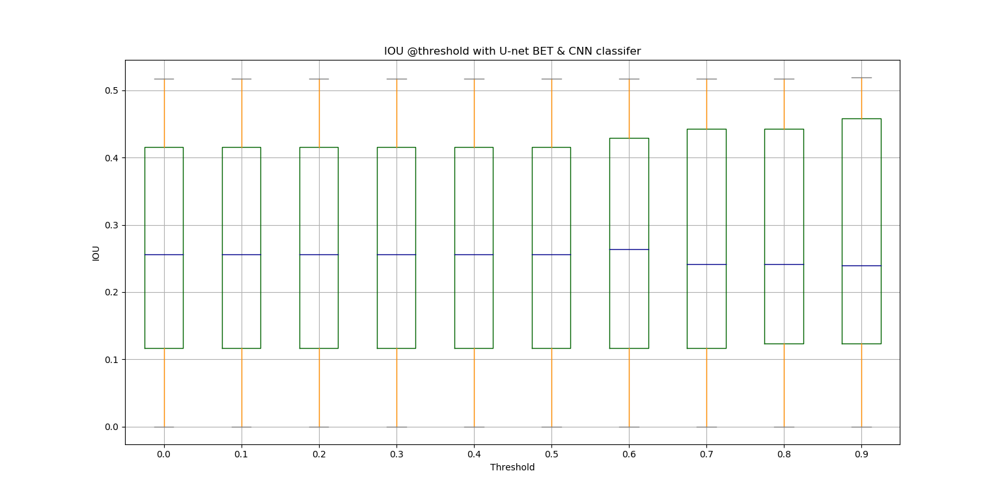

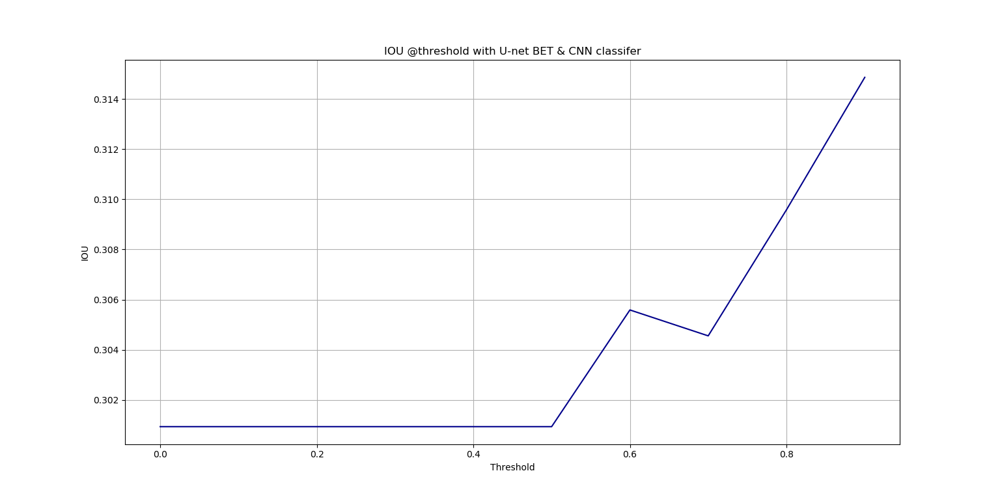

**P-R curve**

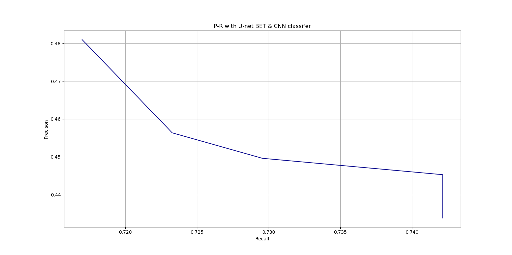

**Precision**

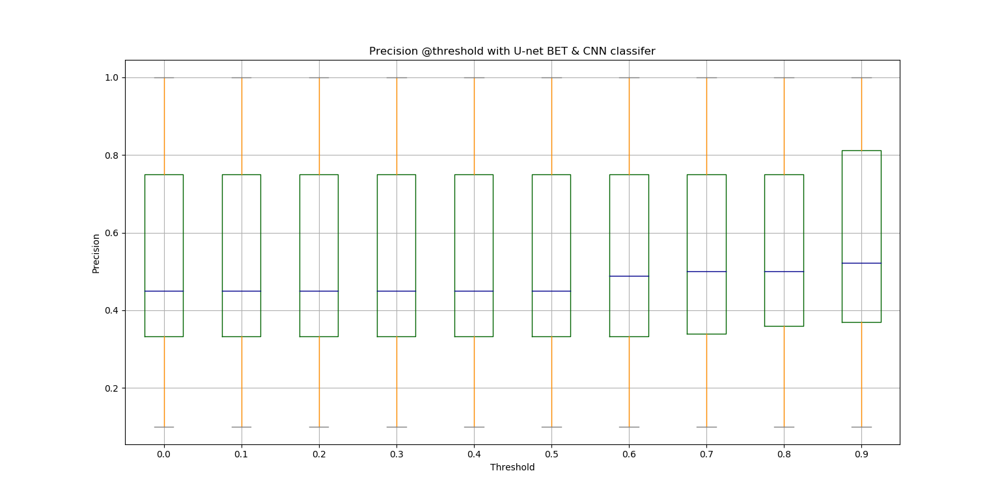

**Recall**

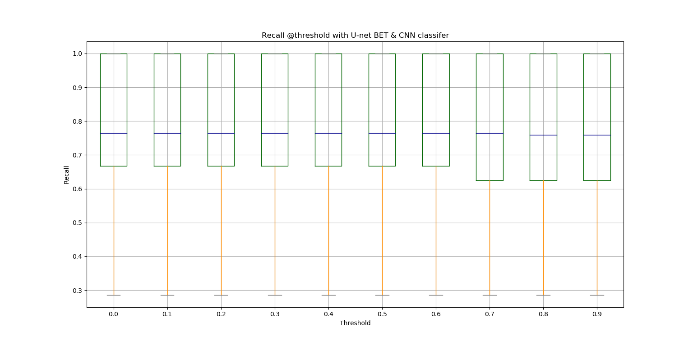

### Unet检测

**IOU**

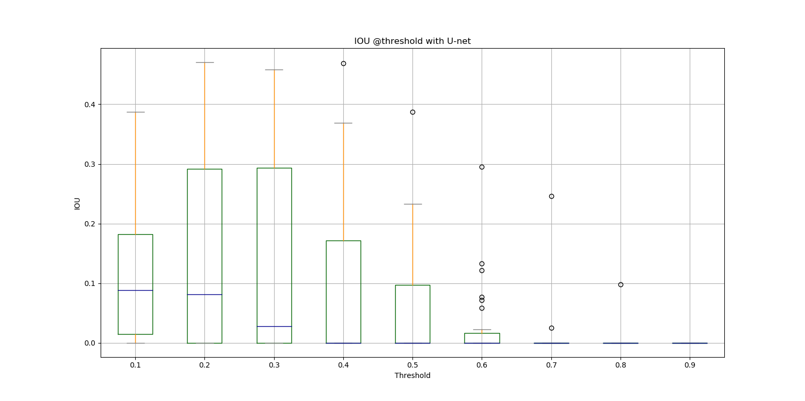

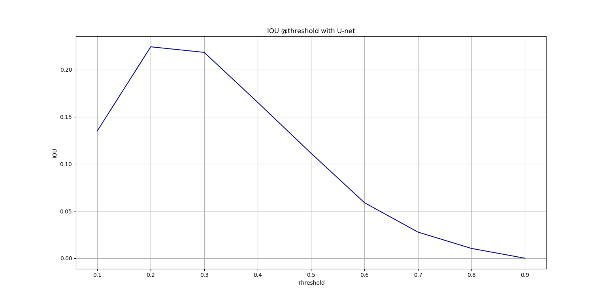

**P-R curve**

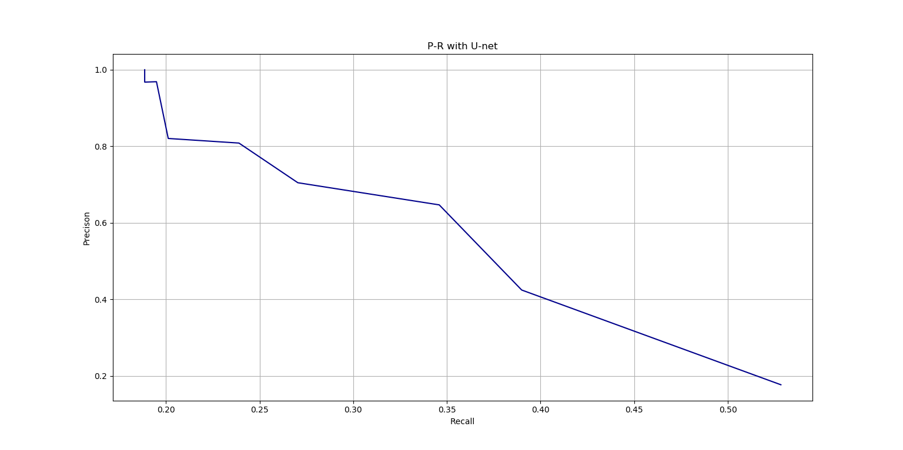

**Precision**

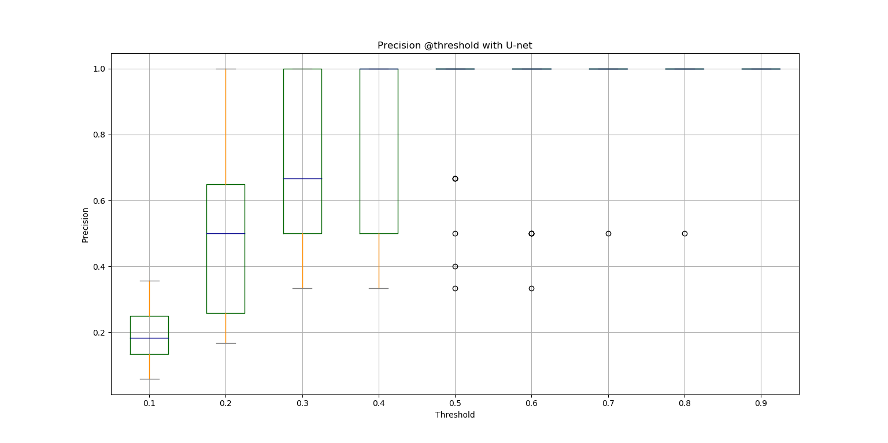

**Recall**

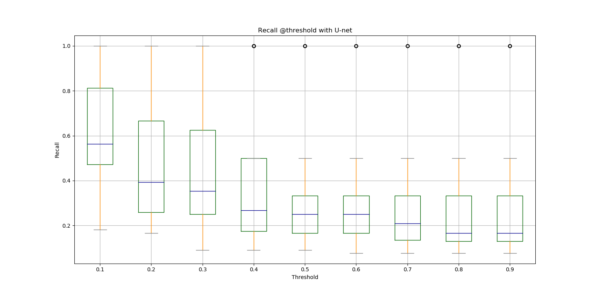

### Unet Heatmap 检测

**IOU**

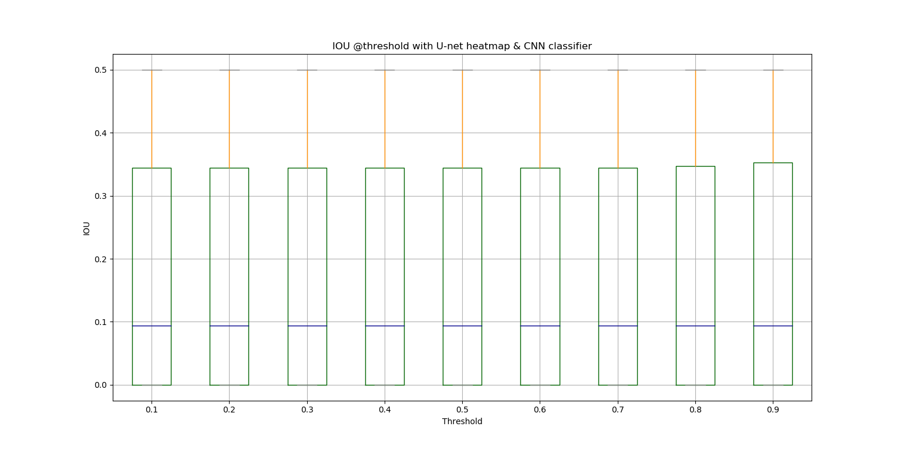

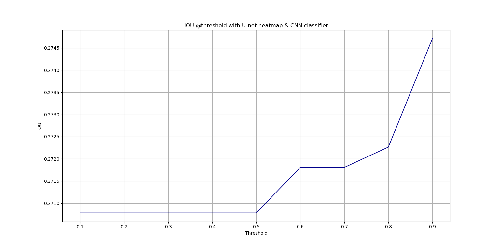

**P-R curve**

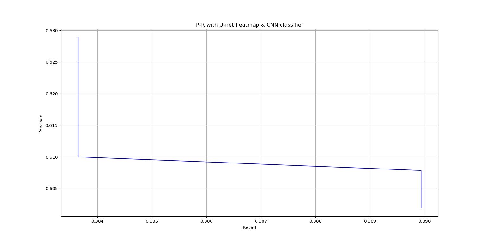

**Precision**

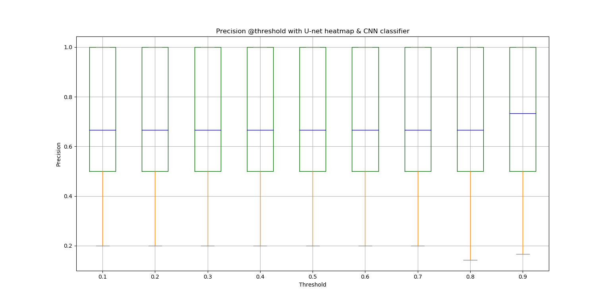

**Recall**

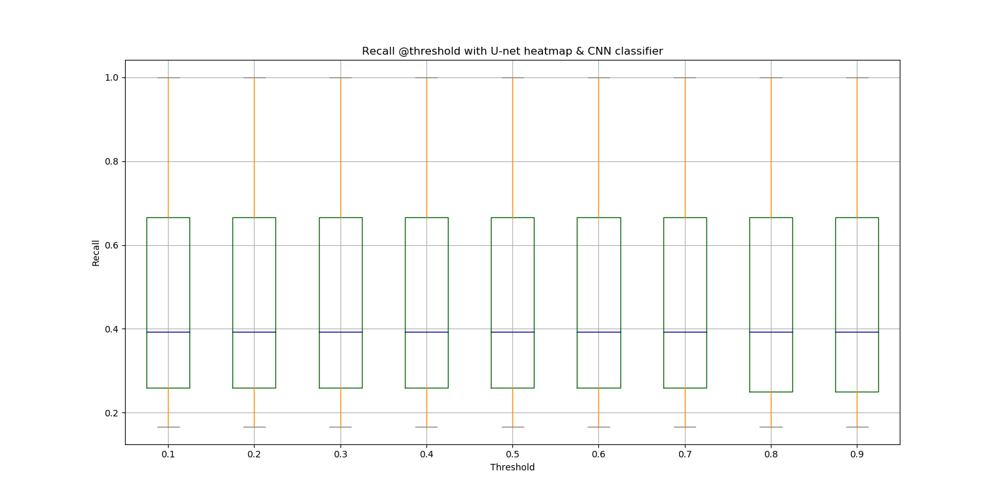


# DICOM格式文件

DICOM文件，后缀.dcm

读取数据及文件信息样例代码

```python
import SimpleITK as sitk
import pydicom


def loadFile(filename):
    ds = sitk.ReadImage(filename)
    img_array = sitk.GetArrayFromImage(ds)
    frame_num, width, height = img_array.shape
    return img_array, frame_num, width, height


def loadFileInformation(filename):
    information = {}
    ds = pydicom.read_file(filename)
    information['PatientID'] = ds.PatientID
    information['PatientName'] = ds.PatientName
    information['PatientBirthDate'] = ds.PatientBirthDate
    information['PatientSex'] = ds.PatientSex
    information['StudyID'] = ds.StudyID
    information['StudyDate'] = ds.StudyDate
    information['StudyTime'] = ds.StudyTime
    information['InstitutionName'] = ds.InstitutionName
    information['Manufacturer'] = ds.Manufacturer
    information['NumberOfFrames'] = ds.NumberOfFrames
    return information
```

# NII格式文件

NII文件，后缀.nii

读取数据样例代码

```python
import nibabel as nib


def loadFile(filename):
    data = nib.load(filename)
    matrix = data.get_data()
    return matrix
```
